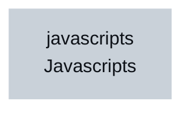

# k0rdent-docs dependency graph

> Generated by [stacklit](https://github.com/glincker/stacklit) on 2026-04-17. Run `stacklit generate` to update.

```mermaid
graph LR
  classDef javascript fill:#c9d1d9,color:#0d1117,stroke:#c9d1d9
  javascripts["javascripts<br/>Javascripts"]:::javascript
```
